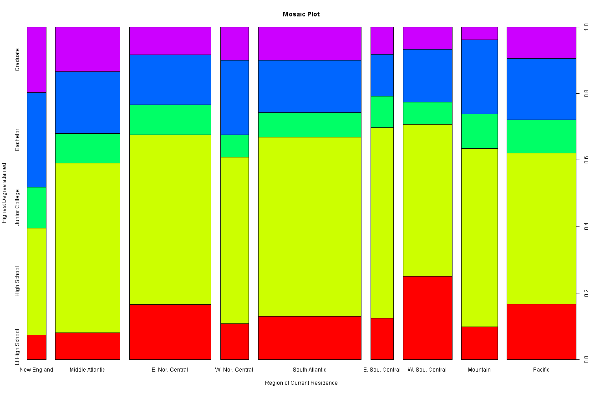

<!-- Replace below with the title of your project -->
### Highest Education Level and Region of Residence in the United States: Are they Related?

### Introduction:

Is someone staying in the South Atlantic region of the United States less or more likely to be a graduate than someone staying in New England? This study is the 1st step in the long process to find this out! This intrigued me because I do not think that relationship between highest education level attained and region of current residence is often explored.It should also be a question of public interest because there is tremendous investment of the US tax-payer's money in education. For example, the federal government,which typically contributes much less for education than the sum contributed by all the state governments or all the local governments in the United States,  allocated approximately $138 billion on education in fiscal year 2013.^1 It is important that this enormous amount of money goes where it is required.

### Data:

Data Collection:  

The data is collected from the General Social Survey which is mostly conducted face-to-face with an in-person interview of adults (18+) in randomly selected households.^2 Computer-assisted personal interviewing (CAPI) began in the 2002 GSS. Under some conditions when it has proved difficult to arrange an in-person interview with a sampled respondent, GSS interviews may be conducted by telephone.^3 The data collected about this survey includes both demographic information and respondent's opinions on various matters. The survey is conducted by the National Opinion Research Center^2 which is one of the largest independent social research organizations in the United States^4.For this study, Data only for the year 2008 has been considered.

Cases:
An unit of observation will be a respondent of the General Social Survey.


Variables:
The 1st variable is the region of current residence of survey respondent which is a categorical , non-ordinal variable.
in R: gss$region

The 2nd variable is the highest educational degree attained which is a categorical, ordinal variable.
in R: gss$degree


Type of Study:
This is an observational study .
Individuals from randomly selected households are interviewed to determine their demographic information and their opinions on various matters. The variables of interest (demographic information, opinions) are observed and not randomly assigned. Therefore, this is a random-sample observational study.


Generalizability:
The population of interest is the entire adult human population of the United States of America.

The findings of the analysis pertains to the subset population of interest who could take the survey English or Spanish, since these are the 2 languages in which GSS is administered.^3

The findings can be approximately generalized because 


a) the respondents are selected by random sampling so sample will be representative of the entire population. 


b) Only the data for the year 2008, which is in the recent past, has been considered, so the findings are generalizable to the adult population of present-day United States.


Potential sources of bias:

a) Non-response Bias: The respondents are chosen by the experimenter randomly, instead of the respondents volunteering. However,selected respondents could opt out.From Question 22 of ( ^3 ), we clearly see that non-response rate is 29.6% for the year 2008. If people from a particular group were more heavily represented among the refusers than in the general population, the sample would have suffered from non-response bias.
For example, covert democrats living in the deep south, may not be comfortable to share their political party affiliations to strangers performing surveys, fearing that if their affiliations are known, they may face social ostracism.

b) Dishonesty of Response: Since the responses were obtained mostly from face-to-face interviews and not anonymously, respondents may have responded dishonestly to conform with generally accepted social norms and/or the views of the head of the household. 

Causality:
This is an observational study and not an experimental study. In such a case, correlations between variables may be observed, but no causal conclusions can be drawn.


Given below, is the R code to load the data. I have displayed this code to show that I have only included responses from the year 2008 to preserve generalizability.

<!-- Enter the code required to load your data in the space below. The data will be loaded but the line of code won't show up in your write up (echo=FALSE) in order to save space-->

```r
load(url("http://bit.ly/dasi_gss_data"))
gss = subset(gss, gss$year == "2008")
```


<!-- In the remainder of the document, add R code chunks as needed -->

### Exploratory data analysis:


```r
table(gss[, c(12, 28)])
```

```
##                 region
## degree           New England Middle Atlantic E. Nor. Central
##   Lt High School           6              22              57
##   High School             26             140             176
##   Junior College          10              24              31
##   Bachelor                23              51              52
##   Graduate                16              37              29
##                 region
## degree           W. Nor. Central South Atlantic E. Sou. Central
##   Lt High School              13             57              12
##   High School                 60            236              55
##   Junior College               8             32               9
##   Bachelor                    27             69              12
##   Graduate                    12             44               8
##                 region
## degree           W. Sou. Central Mountain Pacific
##   Lt High School              52       15      49
##   High School                 95       82     133
##   Junior College              14       16      29
##   Bachelor                    33       34      54
##   Graduate                    14        6      28
```

```r
summary(gss[, c(12, 28)])
```

```
##             degree                 region   
##  Lt High School: 283   South Atlantic :443  
##  High School   :1003   E. Nor. Central:349  
##  Junior College: 173   Pacific        :295  
##  Bachelor      : 355   Middle Atlantic:274  
##  Graduate      : 194   W. Sou. Central:210  
##  NA's          :  15   Mountain       :154  
##                        (Other)        :298
```

Note: New England, E. Sou. Central,and W. Nor. Central regions have been clubbed together in this summary as '(Other)'


Discussion on Summary statistics: Clearly, majority of US citizens' 
highest level educational attainment is high school graduate across all regions. 
However, actual proportions of all the levels varies considerably across
 regions. Therefore, only further analysis will reveal the relationship 
between the region of current residence and the highest level of 
educational attainment.


```r
plot(gss$region,gss$degree,xlab="Region of Current Residence", 
     
     ylab= "Highest Degree attained",col=rainbow(5),main="Mosaic Plot")
```

 

A quick glance at the plot reveals the following:

a) The proportion of people who left high school is the highest in the West South Central region.

b) The proportion of graduates is the highest in the New England region.

From the summary statistics and visualizations, it seems that there is a relationship between the highest level of education attained and the region of current residence. Further analysis will reveal the exact nature of this relationship.

### Inference:

Hypotheses:  

Null Hypothesis: 
Highest Level of Education attained and region of current residence are independent. Education levels do not vary by region.


Alternative Hypothesis:
Highest Level of Education attained and region of current residence are dependent. Education levels do vary by region.


Since the variables in question are both categorical, with both having more than 2 levels, a chi-square test of independence is the most suitable test.This test performs a hypothesis test to check whether proportions across several groups are independent or not. In this case, it will check whether proportion of education levels across regions are independent of the regions or not. No defined parameter of interest exists, so no confidence interval can be determined. 

Conditions:
Sample observations are independent from each other due to the following reasons:

a) GSS is a random-sample survey. 

b)The sampling is done without replacement, that is, a respondent can be part of the survey only once. Total number of responses (units) is 2023 in 2008 while the adult population of USA in 2008 was around 230 million.^6 ^7 
Clearly, sample size is less than 10% of the population. 

c) Every respondent can have only one region of current residence and one highest level of education attained, thus contributing to only one cell in the table tabulating the 2 variables.

It is clear from the 1st table in the exploratory data analysis that every cell,for example, number of people who left high school in New England, has a count of 5 or more.

Thus all the conditions for the chi-square test of independence are satisfied.


R-code:

```r
contingency_table = table(gss[, c(12, 28)])
ct = chisq.test(contingency_table, correct = FALSE)
ct
```

```
## 
## 	Pearson's Chi-squared test
## 
## data:  contingency_table
## X-squared = 82.1, df = 32, p-value = 2.782e-06
```

```r

ct$residuals
```

```
##                 region
## degree           New England Middle Atlantic E. Nor. Central
##   Lt High School   -1.602919       -2.673953        1.201343
##   High School      -2.273249        0.268099        0.279706
##   Junior College    1.143738        0.080974        0.234118
##   Bachelor          2.293686        0.367640       -1.151564
##   Graduate          2.922060        2.046195       -0.750287
##                 region
## degree           W. Nor. Central South Atlantic E. Sou. Central
##   Lt High School       -0.951340      -0.602033       -0.415921
##   High School           0.007719       1.164073        1.017771
##   Junior College       -0.727332      -0.933760        0.253513
##   Bachelor              1.255943      -0.958581       -1.206905
##   Graduate              0.119348       0.258760       -0.418622
##                 region
## degree           W. Sou. Central  Mountain   Pacific
##   Lt High School        4.189872 -1.413389  1.199128
##   High School          -0.872800  0.637857 -1.103854
##   Junior College       -0.926080  0.776228  0.747662
##   Bachelor             -0.622175  1.336443  0.305631
##   Graduate             -1.359775 -2.284138 -0.057846
```


The function chisq.test performs a chi-square test of independence when its 1st argument(in this case, contingency_table) is a 2-dimensional matrix/array/table. The argument correct=TRUE is only required when its 1st argument is a 2X2 matrix/array/table.^8
Since, in this case, contingency_table is not 2X2, the argument 'correct' has been set to 'FALSE'.Please note that the contingency tables with the observed values and the expected values, which are parts of the output of ct,  have not been displayed as the observed  table has already been displayed in the Exploratory Data Analysis section and the residuals display the difference between the two.

The residuals are Pearson residual values which measure the deviation of the observed values from the expected values under the null hypothesis.Most of the residual values are far from zero.^9
The p-value is lower than 2.782e-6, which means that if the proportions of education levels across regions were truly independent(that is, the null hypothesis was indeed true), then the probability of getting these or more extreme observations is less than 2.782e-6. Since the p-value is so small and the residuals deviate considerably from zero, the null hypothesis can be rejected. Since no confidence interval test is applicable in this case, no comparison can be made between the 2 methods.

### Conclusion:

From the results of the chi-square test of independence above, it can be safely concluded that regions in the United States of America show varied proportions in the highest levels of education attained, amongst its current residents, which cannot be explained solely by chance or randomness. Since this is only an observational study, it can only be stated that the 2 variables - region of current residence and highest level of education attained, are correlated. Only experimental studies can confirm whether region of current residence influences highest level of education attained or vice-versa or both are influenced by a 3rd confounding variable. 

Possible future observational studies may include only a few regions, say only regions along the Atlantic Coast, to find whether the present correlation between the variables hold or not. If not, few regions may be amalgamated and treated as one region in similar further studies. Further observational studies may also consider more variables, especially confounding ones like median income, political affiliations, which will reveal much more than the present observational study of only 2 variables. 

However, this study is an important first step to discover the intricate relation between highest level of education attained and the region of current residence of a United States citizen.


### References:

Dataset:
Cetinkaya-Rundel, Mine : General Social Survey Cumulative File, 1972-2012 Coursera Extract. Duke University, 2014.
Download Link:   http://bit.ly/dasi_gss_data

Other References: 

^1 - http://febp.newamerica.net/background-analysis/education-federal-budget

^2 - http://en.wikipedia.org/wiki/General_Social_Survey

^3 - http://www3.norc.org/GSS+Website/FAQs/ 

^4 - http://en.wikipedia.org/wiki/National_Opinion_Research_Center

^5 - http://publicdata.norc.org/GSS/DOCUMENTS/CODEBOOK/A.pdf

^6 - http://en.wikipedia.org/wiki/Voter_turnout_in_the_United_States_presidential_elections

^7 - http://www.history.com/topics/the-26th-amendment

^8 - http://ww2.coastal.edu/kingw/statistics/R-tutorials/independ.html

^9 - http://stat.ethz.ch/R-manual/R-patched/library/stats/html/chisq.test.html

### Appendix:


```r
gss[1:20, c(12, 28)]
```

```
##               degree          region
## 51021    High School Middle Atlantic
## 51022       Graduate Middle Atlantic
## 51023    High School Middle Atlantic
## 51024    High School Middle Atlantic
## 51025    High School Middle Atlantic
## 51026       Bachelor Middle Atlantic
## 51027    High School Middle Atlantic
## 51028    High School Middle Atlantic
## 51029    High School Middle Atlantic
## 51030 Lt High School Middle Atlantic
## 51031       Graduate Middle Atlantic
## 51032       Graduate Middle Atlantic
## 51033       Bachelor Middle Atlantic
## 51034    High School Middle Atlantic
## 51035       Bachelor Middle Atlantic
## 51036       Graduate Middle Atlantic
## 51037    High School Middle Atlantic
## 51038    High School Middle Atlantic
## 51039       Bachelor Middle Atlantic
## 51040 Junior College Middle Atlantic
```

